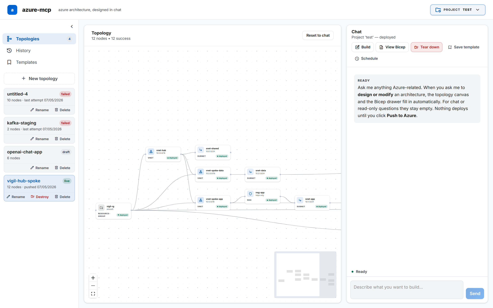
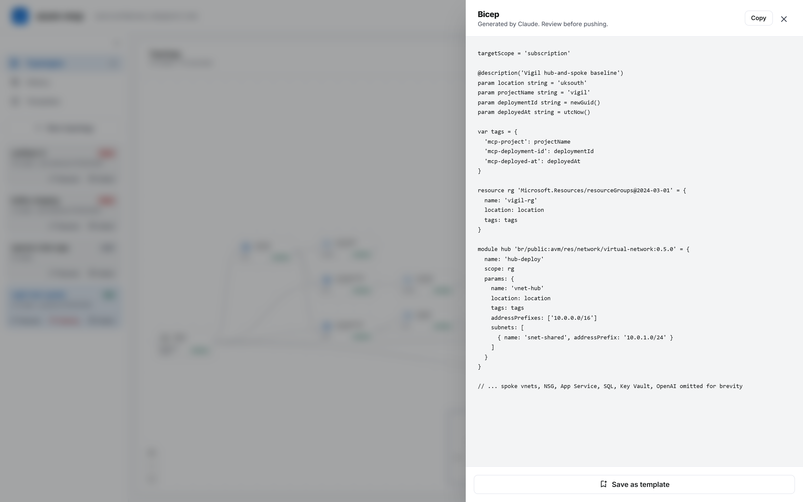
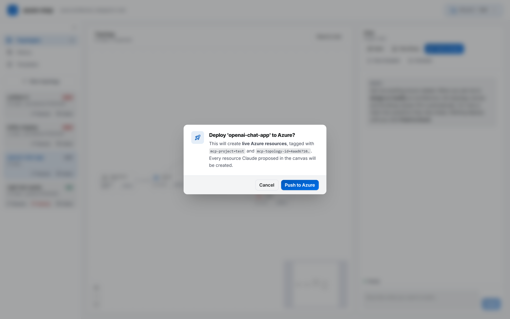
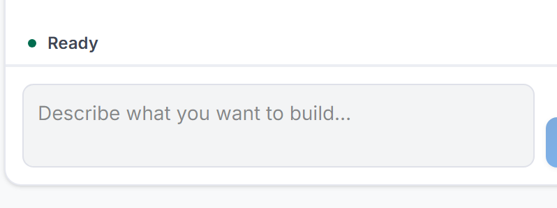
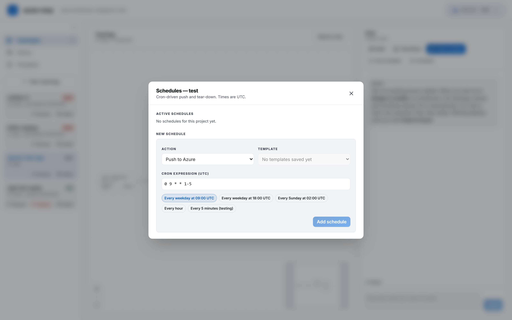

# azure-mcp

> **Design Azure architecture in chat. Push it live with one click. Tear it down when you're done.**

A single-user web tool that turns natural-language conversation with Claude into deployed Azure infrastructure. The chat panel proposes the design, a topology canvas auto-lays-out what's being built, and Microsoft's official Azure MCP Server (plus a custom `deploy_bicep` tool that wraps `az deployment`) actually creates the resources.

Designed and built end-to-end by Steven Johnston with [Claude Code](https://claude.com/claude-code) — every component, the schema, the agentic loop, the lifecycle UI. Lives on a homelab, fronted by Cloudflare Access, running on `net_core` Docker network.

---

## Screenshots

> Drop PNGs into `docs/screenshots/` matching the filenames below. The README references them so they auto-render once committed.

| | |
|---|---|
|  | The two-pane workspace: topology canvas on the left, streaming Claude chat on the right. Left rail holds Topologies / History / Templates. |
|  | Claude proposes architecture, the canvas auto-lays-out via dagre, the Bicep drawer holds the generated template. |
|  | Stage bar: Build → View Bicep → Push → Tear-down. `deploy_bicep` runs `az deployment create` against your service principal. |
|  | Live "what is the agent doing right now" row above the composer — calling tool, reasoning, writing — with elapsed time. |
|  | Cron-driven push and tear-down of saved templates — daily lab spin-up, nightly tear-down. |

---

## What it does, in one paragraph

You describe what you want — *"a small App Service with a SQL DB"*, *"a hub-and-spoke network with two spokes"*, *"an OpenAI chat app behind private endpoints"*. Claude proposes the architecture, emits a structured `<topology>` marker the canvas reads, and a `<bicep>` template you can review in a side drawer. When you click **Push to Azure**, a custom `deploy_bicep` tool spawns Microsoft's official `azure-cli` container with your service principal, runs `az deployment sub create -f main.bicep`, and enforces the project + topology tags on every created resource so cleanup is precise. When you're done, **Destroy** finds resources by tag and cascades deletes through `az group delete`. **Schedule** does the same on a cron — daily lab spin-up, nightly tear-down.

---

## Why this exists

The Microsoft Azure MCP Server exposes 60+ tools for inspection, best-practices advice, app-code deployment via `azd`, and Bicep schema lookup — but no tool for "deploy this raw Bicep template" and no resource-group-delete. This project fills that gap with two tightly-scoped custom tools (`deploy_bicep`, `destroy_azure`) and wraps the whole thing in a chat-driven workflow keyed to a per-project tag scheme.

It's also a working reference for chat-driven IaC — turn-by-turn agentic loops, prompt caching across a 320-tool registry, structured markers (`<topology>`, `<bicep>`, `<answers>`) parsed mid-stream, lifecycle stages (`build` / `view` / `push` / `teardown` / `free`) with appropriate tool gating per stage.

---

## Stack

| Layer | Choice | Why |
|---|---|---|
| Frontend | React 19 + Vite + TypeScript + Tailwind 4 | Matches the netbud sibling project; Tailwind 4's `@theme` block keeps the MD3 colour palette in CSS. |
| Canvas | [React Flow](https://reactflow.dev) (`@xyflow/react`) + dagre | Auto-layout via `@dagrejs/dagre`. Material Symbols stand in for Azure resource icons (CDN, no bundle weight). |
| Backend | Node 22 + Fastify 5 + TypeScript | First-class streaming, native SSE, lighter than Express. |
| MCP client | `@modelcontextprotocol/sdk` over stdio | Spawns Microsoft's `mcr.microsoft.com/azure-sdk/azure-mcp` container as a child process per backend lifetime. |
| Anthropic SDK | `@anthropic-ai/sdk` | Streaming Messages API with prompt caching on the system + 320-tool prefix. |
| Database | Postgres 16 (raw `pg` driver, no ORM) | Three tables: `projects`, `topologies`, `deployments`, `templates`, `schedules`. Plus idempotent `node-pg-migrate`-style migrations on startup. |
| Scheduler | `node-cron` in-process | Loads enabled rows from `schedules` at boot; reloads on every CRUD. UTC. |
| Edge | Cloudflare tunnel + Access (header-asserted email auth) | Same homelab pattern netbud uses. No internal login screen. |

---

## Architecture

```
                 [Browser]
                     │  HTTPS via Cloudflare tunnel + Access
                     ▼
                [Cloudflare Edge]
                     │  Cf-Access-Authenticated-User-Email header
                     ▼
   ┌── net_core Docker network ──────────────────────────┐
   │                                                     │
   │   azure-mcp-frontend       (nginx serving SPA)      │
   │     │                                               │
   │     │  /api/* proxied to ↓                          │
   │     ▼                                               │
   │   azure-mcp-backend        (Fastify + TS)           │
   │     ├──> Anthropic Messages API (stream + tools)    │
   │     ├──> spawned: azure-mcp        (MS MCP server)  │
   │     ├──> spawned: azure-cli sidecar (deploy/destroy)│
   │     └──> azure-mcp-db      (Postgres 16)            │
   │                                                     │
   └─────────────────────────────────────────────────────┘
                     │
                     ▼  service-principal credentials
            [Azure Resource Manager]
```

The backend doesn't call Azure directly. It runs an **agentic chat loop**: each user message goes to Claude with the combined tool list (Microsoft's MCP server tools + our `deploy_bicep` and `destroy_azure`), and tool calls are dispatched to the right handler. `deploy_bicep` and `destroy_azure` spawn the official `mcr.microsoft.com/azure-cli` image as a docker sidecar with the project's service principal mounted in.

---

## Lifecycle stages

Every chat turn happens in one of five stages. The active stage is told to Claude in a per-request system block (so changing stage doesn't invalidate the cached prompt prefix).

| Stage | What's allowed | Tools Claude reaches for |
|---|---|---|
| `build` | propose architecture; **no Azure mutation** | inspection MCP tools (`*_list`, `*_show`), `bicepschema_get` |
| `view` | same as build, user is reviewing | (read-only) |
| `push` | execute the deployment | `deploy_bicep` (canonical), MCP create ops |
| `teardown` | delete the project's resources | `destroy_azure` (canonical) |
| `free` | ad-hoc questions outside the lifecycle | read-only by default |

Claude emits `<topology>{...}</topology>` and `<bicep>...</bicep>` markers in build/view turns; the frontend strips them from the chat display, parses the JSON, and pushes the topology into the React Flow canvas + the Bicep into a side drawer. Markers persist per-topology in Postgres so reloads don't lose state.

---

## Topology lifecycle

A project can hold many topologies. Each one is `draft` (designed, not pushed), `live` (successfully pushed), `failed` (push errored), or `destroyed` (was live, Azure resources torn down).

```
draft  ──[Push to Azure]──→  live  ──[Destroy]──→  destroyed
  │                            │                       │
  │                       ──[Push fails]──→  failed    │
  │                                            │       │
  └────[Delete (record only)]──[Delete]────[Delete]    │
                                                  └────[Delete]
```

Resources are tagged with **both** `mcp-project=<name>` AND `mcp-topology-id=<uuid>` (post-deploy enforced via `az tag update --operation Merge`, so even if the Bicep template misses a tag the canonical filter still works). Per-topology destroy filters by both tags; project-wide tear-down filters by project only.

---

## First-time setup

### 1. Mint an Azure service principal

Subscription-wide Contributor (or scope down to a single resource group — see DECISIONS.md):

```powershell
$SUB_ID = az account show --query id -o tsv
az ad sp create-for-rbac `
  --name "azure-mcp-homelab" `
  --role Contributor `
  --scopes "/subscriptions/$SUB_ID"
```

Copy the four values into `.env` (use `.env.example` as the template):

```
AZURE_TENANT_ID=
AZURE_CLIENT_ID=
AZURE_CLIENT_SECRET=
AZURE_SUBSCRIPTION_ID=
ANTHROPIC_API_KEY=
ANTHROPIC_MODEL=claude-opus-4-7
POSTGRES_PASSWORD=change-me
TRUSTED_USER_EMAIL=you@example.com
```

### Optional: GitHub sync

Set `GH_TOKEN` (a personal access token with `repo` scope) and `GH_OWNER` (your GitHub username) in `.env` to enable per-project sync to GitHub. The dropdown gains a **Sync** button per project that:

- creates `${GH_OWNER}/azure-mcp-<project-name>` if it doesn't exist (private by default; flip with `GH_REPO_VISIBILITY=public`),
- writes a generated `README.md` listing every topology and its status,
- writes one `topologies/<topology-name>.bicep` per topology with bicep content.

The dropdown row shows "GitHub · synced X ago" for synced projects. Leave the env vars unset and the GitHub UI hides itself.

### 2. Bring it up

The repo expects an existing external Docker network called `net_core` (the homelab convention). Create one if you don't have it:

```bash
docker network create net_core
```

Then:

```bash
docker compose up -d --build
```

First boot pulls `mcr.microsoft.com/azure-sdk/azure-mcp:latest` and `mcr.microsoft.com/azure-cli:latest` (~600MB combined), builds the backend + frontend, and runs the schema migration.

### 3. Wire Cloudflare (optional — for production access)

Add a Public Hostname in Cloudflare Zero Trust:
- Subdomain: your choice (e.g. `azure-mcp`)
- Service: `http://azure-mcp-frontend:80`
- Application policy: require your email

The backend's trusted-email guard (`backend/src/plugins/trustedEmail.ts`) rejects requests whose `Cf-Access-Authenticated-User-Email` header doesn't match `TRUSTED_USER_EMAIL`.

### 4. Local-only access (skip Cloudflare)

Copy the override:

```bash
cp docker-compose.override.yml.example docker-compose.override.yml
docker compose up -d
```

Hit `http://localhost:18080` (or whatever port the override file specifies). The override sets `NODE_ENV=development` on the backend, which bypasses the Cloudflare-Access header check for direct localhost requests.

---

## Repo layout

```
azure-mcp/
├── docker-compose.yml                    four services on net_core
├── docker-compose.override.yml.example   local-dev port publishing
├── .env.example
├── README.md                             this file
├── DECISIONS.md                          plain-English log of architecture choices
├── CLAUDE.md                             spec / collaboration brief for Claude Code
│
├── frontend/                             React + Vite + Tailwind 4
│   ├── src/
│   │   ├── components/
│   │   │   ├── canvas/                   React Flow + Azure node
│   │   │   ├── chat/                     ChatPanel, StageBar, BicepDrawer, ChatActivity
│   │   │   ├── projects/
│   │   │   ├── rail/                     LeftRail, TopologiesList
│   │   │   ├── scheduler/
│   │   │   └── ui/                       ConfirmDialog, useConfirm
│   │   ├── hooks/useChat.ts              streaming SSE + marker parsing
│   │   ├── lib/                          api client, types, parsers, dagre layout
│   │   └── App.tsx                       state orchestration
│   ├── index.html
│   ├── nginx.conf
│   └── Dockerfile                        multi-stage: vite build → nginx
│
├── backend/                              Node 22 + Fastify + TS
│   ├── src/
│   │   ├── server.ts                     entry; routes + scheduler bootstrap
│   │   ├── config.ts                     env-var validation; refuses to boot on missing
│   │   ├── routes/                       chat, projects, topologies, templates,
│   │   │                                 deployments, schedules, mcp
│   │   ├── claude/
│   │   │   ├── client.ts                 Anthropic SDK
│   │   │   ├── system-prompt.ts          frozen prompt (cached)
│   │   │   ├── tool-bridge.ts            merges MCP + custom tools, dispatches
│   │   │   └── custom-tools.ts           deploy_bicep, destroy_azure
│   │   ├── mcp/client.ts                 stdio transport spawning Microsoft's MCP image
│   │   ├── scheduler/index.ts            node-cron loop
│   │   ├── plugins/trustedEmail.ts       Cloudflare Access header guard
│   │   └── db/                           pg pool + idempotent migrate
│   └── Dockerfile                        node:22-alpine + docker-cli for sibling spawns
│
└── db/init.sql                           initial schema
```

---

## Stage bar reference

Top of the chat panel:

| Button | Visible when | Effect |
|---|---|---|
| `Build` | always | Click to start a new draft topology (clears canvas + bicep). |
| `View Bicep` | bicep emitted | Open the side drawer with the generated template + "Save as template". |
| `Push to Azure` | bicep + topology, not yet pushed | Confirm dialog → `deploy_bicep` runs → topology flips to `live` (or `failed`). |
| `Tear down` | topology is `live` | Project-wide destroy via `destroy_azure` with the project tag filter. |
| `Save template` | bicep emitted | Save the current Bicep as a reusable template (used by the scheduler). |
| `Schedule` | always | Open the cron scheduler modal — push or tear-down a template on a UTC cron expression. |

Per-topology **Destroy** (just that topology, not the whole project) lives in the rail next to each topology card.

---

## Key design choices

- **Stdio transport for MCP, not HTTP.** Microsoft's image had blocking issues with `--transport=http` at the version we built against (the auth-disable flag silently aborted; OAuth metadata pointed at a malformed tenant URL). Stdio sidesteps both — we spawn the official image with docker, pipe JSON-RPC, done. Lifetime is tied to the backend process.
- **Hybrid execution model for push/teardown.** User-driven actions stream through chat (you see Claude's reasoning live). Scheduled actions go through the same chat loop but headless (non-streaming). Single execution path, two consumers.
- **Tag enforcement is post-deploy, not prompt-driven.** Asking Claude to remember every tag across rename iterations is fragile. Instead `deploy_bicep` runs `az tag update --operation Merge` against every output resource (and cascades to the RG's children) after the deployment succeeds. Idempotent. Bicep can forget the tags entirely and they'll still end up applied.
- **Lifecycle stages enforced by prompt, not tool-list filtering.** Filtering mutating tools out of the registry per stage is fragile (Microsoft's tool surface is exposed via namespace tools that take an `operation` argument, denylisting that is brittle). Claude reliably honours stage instructions in practice.
- **Confirmation dialogs are styled.** No `window.confirm()` — `useConfirm()` hook with a portal-mounted styled dialog matching the rest of the design.

Full rationale and trade-offs in [DECISIONS.md](DECISIONS.md).

---

## Lineage

- The visual style (palette, typography, component shapes, MD3 token system) is borrowed from a sibling tool, [`netbud`](https://netbud.clydeford.net), so the two read as the same family.
- The chat-driven IaC pattern, the structured-marker approach, and the lifecycle-stage model are designed for this project. Microsoft's [`microsoft/azure-skills`](https://github.com/microsoft/azure-skills) covers the same problem space with a different shape (azd-project-based, with `.azure/deployment-plan.md` artefacts) — DECISIONS.md compares the two.

---

## License

MIT (see `LICENSE`).
